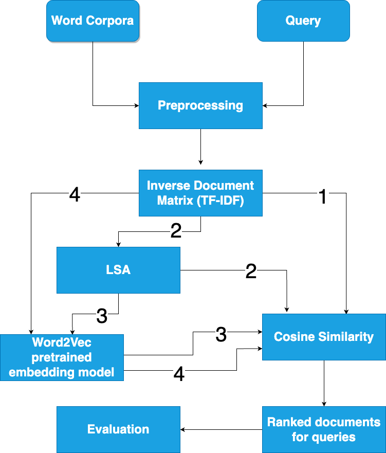

# Search Engine Preprocessing Pipeline

This repository contains the template and working code for a search engine application built as part of an NLP assignment.

## Model Architecture


---

## 📁 Project Structure

```plaintext
.
├── MM19B046-MM19B022-NLP-1.pdf              # Assignment report
├── Project2_LSA+W2V.ipynb                   # Word2Vec + LSA model notebook
├── Project2_LSA+W2V_FINAL.pdf               # Model code document
├── Project2_LSA+bert.ipynb                  # BERT-based model notebook
├── model_flow_nlp.png                       # System architecture diagram
├── README.md                                # Project overview
└── code/
    ├── main.py                              # Main driver script (DO NOT modify)
    ├── util.py                              # Utility functions (customizable)
    ├── inflectionReduction.py               # Lemmatization/stemming logic
    ├── sentenceSegmentation.py              # Sentence segmentation logic
    ├── stopwordRemoval.py                   # Stop word removal logic
    ├── tokenization.py                      # Tokenization logic
    ├── cranfield/                           # Cranfield dataset
    │   ├── cran_docs.json
    │   ├── cran_qrels.json
    │   ├── cran_queries.json
    │   └── README.txt
    ├── output/                              # Outputs after each stage
    │   ├── outputsegmented_docs.txt
    │   ├── outputsegmented_queries.txt
    │   ├── outputtokenized_docs.txt
    │   ├── outputtokenized_queries.txt
    │   ├── outputstopword_removed_docs.txt
    │   ├── outputstopword_removed_queries.txt
    │   ├── outputreduced_docs.txt
    │   └── outputreduced_queries.txt
    └── __pycache__/                         # Cached Python files
```
---
## 🚀 How to Run
Use the main.py script to run the full preprocessing pipeline.

### Basic Usage:
```
python main.py [-custom] [-dataset DATASET_FOLDER] [-out_folder OUTPUT_FOLDER]
               [-segmenter SEGMENTER_TYPE (naive|punkt)] 
               [-tokenizer TOKENIZER_TYPE (naive|ptb)]

```

### Example usage 
```
python main.py -custom

```

Read the final report for additional details 
